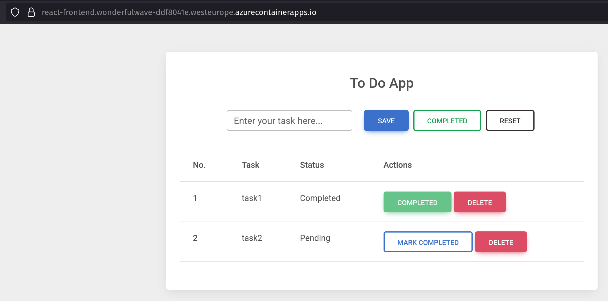
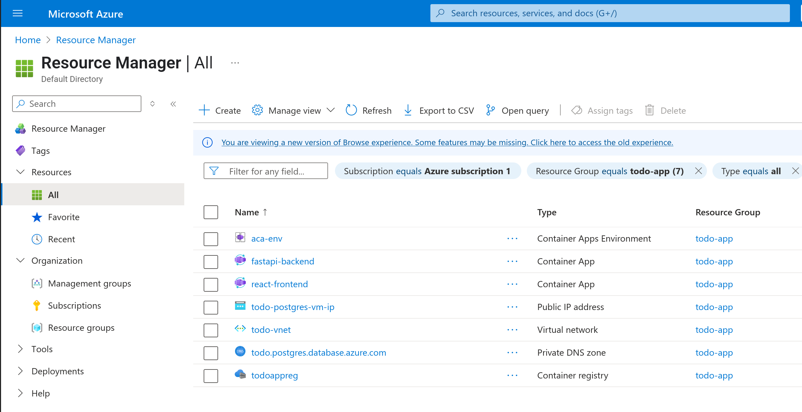
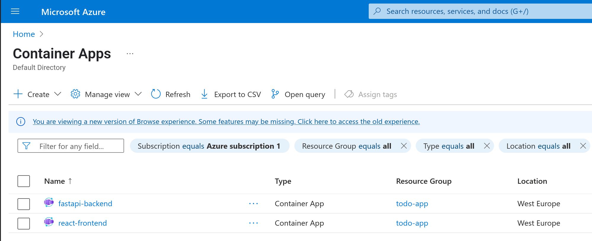

# To-do App Infrastructure

This project is a simple to-do app 
The project focus is on the app infrastructure, IaC, and DevOps approach 
The app is designed for Azure cloud usage

## Techstack

- Frontend: React & Tailwind CSS
- Backend: FastAPI
- Database: PostgreSQL
- IaC: Azure Resource Manager
- CI/CD: GitHub Actions
- Cloud infrastructure: Azure Container Apps

### System Design (demo environment)

The todo-app have the following two main service:

1. react-frontend
2. fastapi-backend

The database is deployed locally in the fastapi service 
and can be deployed on a dedicated container-apps: postgres-db with attached volume for data persistency

App url is via the following link: [APP LINK](https://react-frontend.wonderfulwave-ddf8041e.westeurope.azurecontainerapps.io/)

### IaC and CI/CD

The app stack is deployed via GitHub Actions, and designed for Platform Engineering 
Please check the **Actions** tab

### IaC pipelines

1. Resource group
2. Virtual network
3. Container registry
4. Build fastapi-backend
5. Build react-frontend
6. Deploy fastapi-backend
7. Deploy react-frontend

### App Deployment (step-by-step)

1. Deploy resource group
2. Deploy virtual network
3. Deploy container registry
4. Get the registry password, and update the registry password in GitHub actions secrets
5. Build fastapi-backend
6. Build react-fronend
7. Deploy fastapi-backend
8. Update the fastapi-backend baseurl in the `Todos.js` file of the react-frontend
9. Deploy react-frontend
10. Check the url of react-frontend

### Resources

